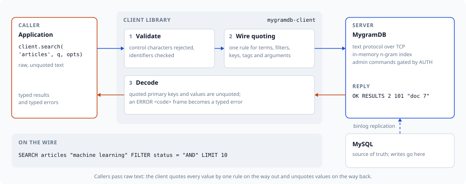

# Getting Started with mygramdb-client

This guide will help you get started with the mygramdb-client library for Node.js.



## Prerequisites

- Node.js 22.0.0 or higher
- Yarn 4.x (managed via mise)
- A running MygramDB server

## Installation

### Using Yarn (recommended)

```bash
yarn add mygramdb-client
```

### Using npm

```bash
npm install mygramdb-client
```

## Basic Setup

### 1. Import the Client

```typescript
import { MygramClient } from 'mygramdb-client';
```

### 2. Create a Client Instance

```typescript
const client = new MygramClient({
  host: 'localhost',
  port: 11016,
  timeout: 5000,
});
```

### 3. Connect to Server

```typescript
await client.connect();
```

### 4. Perform Operations

```typescript
// Search for documents
const results = await client.search('articles', 'hello world');
console.log(`Found ${results.totalCount} results`);

// Count matching documents
const count = await client.count('articles', 'technology');
console.log(`Total matches: ${count.count}`);

// Get document by ID
const doc = await client.get('articles', '12345');
console.log(doc);
```

### 5. Disconnect

```typescript
await client.disconnect();
```

## Complete Example

```typescript
import { MygramClient } from 'mygramdb-client';

async function main() {
  const client = new MygramClient({
    host: 'localhost',
    port: 11016,
    timeout: 5000,
  });

  try {
    await client.connect();
    console.log('Connected to MygramDB');

    // Perform a search
    const results = await client.search('articles', 'golang tutorial', {
      limit: 10,
      sortColumn: 'created_at',
      sortDesc: true,
    });

    console.log(`Found ${results.totalCount} results`);
    results.results.forEach((result) => {
      console.log(`- ${result.primaryKey}`);
    });
  } catch (error) {
    console.error('Error:', error);
  } finally {
    client.disconnect();
  }
}

main();
```

## Configuration Options

The `MygramClient` constructor accepts a configuration object with the following options:

| Option | Type | Default | Description |
|--------|------|---------|-------------|
| `host` | string | `'127.0.0.1'` | Server hostname or IP address |
| `port` | number | `11016` | Server port number |
| `timeout` | number | `5000` | Deadline for one ordinary command, in milliseconds |
| `connectTimeout` | number | same as `timeout` | Deadline for connecting and `AUTH`, in milliseconds |
| `dumpSaveTimeout` | number | `600000` | Deadline for `DUMP SAVE`, in milliseconds |
| `dumpLoadTimeout` | number | `600000` | Deadline for `DUMP LOAD`, in milliseconds |
| `dumpVerifyTimeout` | number | `600000` | Deadline for `DUMP VERIFY`, in milliseconds |
| `optimizeTimeout` | number | `600000` | Deadline for `OPTIMIZE`, in milliseconds |
| `recvBufferSize` | number | `65536` | Receive buffer size in bytes |
| `maxResponseBytes` | number | `67108864` | Largest response frame accepted, in bytes |
| `adminToken` | string | — | Sent as `AUTH <token>` on every connect (MygramDB 1.10 or later) |

Dumps and `OPTIMIZE` walk the whole index, so they get their own deadlines
instead of the request timeout — raising `timeout` for their sake would slow
down failure detection on ordinary queries.

### Example with Custom Configuration

```typescript
const client = new MygramClient({
  host: '192.168.1.100',
  port: 11016,
  timeout: 10000,
  recvBufferSize: 131072,
});
```

### Administrative Commands

Administrative commands — `DUMP *`, `REPLICATION *`, `SYNC *`, `CONFIG *`,
`OPTIMIZE`, `DEBUG *`, `CACHE *`, `SET` and `SHOW VARIABLES` — require an
`AUTH` on the same connection (MygramDB 1.10 or later). Set `adminToken` and
the client authenticates on every connect, reconnects included. Searching
needs no token, and neither does any command against a server that was
started without a token of its own — see [Administrative
Authentication](./advanced-usage.md#administrative-authentication).

```typescript
const client = new MygramClient({ adminToken: process.env.MYGRAM_ADMIN_TOKEN });
await client.connect();
await client.dumpSave('/var/lib/mygramdb/dump.mgd');
```

## Error Handling

The library provides specific error types for different failure scenarios:

```typescript
import { MygramClient, ConnectionError, ServerError, TimeoutError } from 'mygramdb-client';

try {
  await client.connect();
  const results = await client.search('articles', 'test');
} catch (error) {
  if (error instanceof ConnectionError) {
    console.error('Failed to connect to server:', error.message);
  } else if (error instanceof ServerError) {
    // Numeric code available on MygramDB 1.10+; undefined on older servers.
    console.error(`Server returned an error (${error.code ?? 'no code'}):`, error.message);
  } else if (error instanceof TimeoutError) {
    console.error('Request timed out:', error.message);
  } else {
    console.error('Unexpected error:', error);
  }
}
```

`ServerError` extends `ProtocolError`, so existing code that catches
`ProtocolError` still sees every server-side rejection.

## Next Steps

- Read the [API Reference](./api-reference.md) for detailed documentation of all methods
- Learn about [Search Expressions](./search-expression.md) for advanced search queries
- Explore [Advanced Usage](./advanced-usage.md) for connection pooling and batch operations

## TypeScript Support

The library is written in TypeScript and provides full type definitions. TypeScript users get automatic type checking and IntelliSense support:

```typescript
import type { ClientConfig, SearchResponse, SearchOptions } from 'mygramdb-client';

const config: ClientConfig = {
  host: 'localhost',
  port: 11016,
  maxQueryLength: 256,
};

const options: SearchOptions = {
  limit: 100,
  sortColumn: 'created_at',
  sortDesc: true,
};

const results: SearchResponse = await client.search('articles', 'test', options);
```

## Troubleshooting

### Connection Refused

If you get a connection refused error, make sure:
- MygramDB server is running
- The host and port are correct
- No firewall is blocking the connection

### Timeout Errors

If requests are timing out:
- Increase the `timeout` value in the configuration
- Check server performance and load
- Verify network connectivity

### Protocol Errors

If you get protocol errors:
- Ensure you're using a compatible version of MygramDB
- Check server logs for error details
- Verify the table name and query syntax are correct

### Input Validation Errors

If you see `InputValidationError`, inspect the query and filter values for control characters or overly long expressions.
Increase `ClientConfig.maxQueryLength` (and the server-side `api.max_query_length`) if the application legitimately needs longer queries.
